# Autenticación LDAP Web

## 1. ¿Qué es autenticación LDAP?

LDAP (Lightweight Directory Access Protocol) es un protocolo que permite validar usuarios 
contra un servidor centralizado. Esto permite que múltiples sistemas utilicen las mismas 
credenciales para autenticación.

---

## 2. Flujo de autenticación

El proceso de autenticación funciona de la siguiente manera:

1. El usuario ingresa su usuario y contraseña en la página web.
2. El sistema PHP recibe los datos mediante un formulario.
3. PHP construye el DN del usuario en LDAP.
4. Se realiza una conexión al servidor LDAP.
5. Se intenta autenticar con `ldap_bind`.
6. Si las credenciales son correctas, se permite el acceso.
7. Si son incorrectas, se rechaza el acceso.

---

## 3. Código PHP

El sistema utiliza PHP para conectarse a LDAP y validar usuarios en múltiples unidades organizativas.

<?php
$ldapconn = ldap_connect("ldap://localhost");
ldap_set_option($ldapconn, LDAP_OPT_PROTOCOL_VERSION, 3);

$user = $_POST['user'];
$pass = $_POST['pass'];

$dn = "uid=$user,ou=IT,dc=empresa,dc=com";

if (@ldap_bind($ldapconn, $dn, $pass)) {
        echo "Autenticacion exitosa";
} else {
        echo "Error de autenticacion";
}
?>
---

## 4. Extensión implementada

Se modificó el sistema para permitir autenticación desde dos unidades organizativas diferentes:

* IT
* Soporte

El sistema intenta autenticarse primero en IT y, si falla, intenta en Soporte.

Nuevo Login:

<?php
$ldapconn = ldap_connect("ldap://localhost");
ldap_set_option($ldapconn, LDAP_OPT_PROTOCOL_VERSION, 3);

// Validar entrada
if (!isset($_POST['user']) || !isset($_POST['pass'])) {
    echo "Acceso inválido";
    exit;
}

$user = $_POST['user'];
$pass = $_POST['pass'];

// Lista de OU
$ous = ["IT", "Soporte"];

$autenticado = false;

foreach ($ous as $ou) {
    $dn = "uid=$user,ou=$ou,dc=empresa,dc=com";

    if (ldap_bind($ldapconn, $dn, $pass)) {
        echo "✅ Autenticación exitosa en $ou: $user";
        $autenticado = true;
        break;
    }
}

if (!$autenticado) {
    echo "❌ Error de autenticación";
}
?>

---

## 5. Evidencias

Se incluyen capturas de:

* Ejecución de ldapwhoami (correcto)
* Ejecución de ldapwhoami (incorrecto)
* Formulario web
* Login exitoso
* Login fall

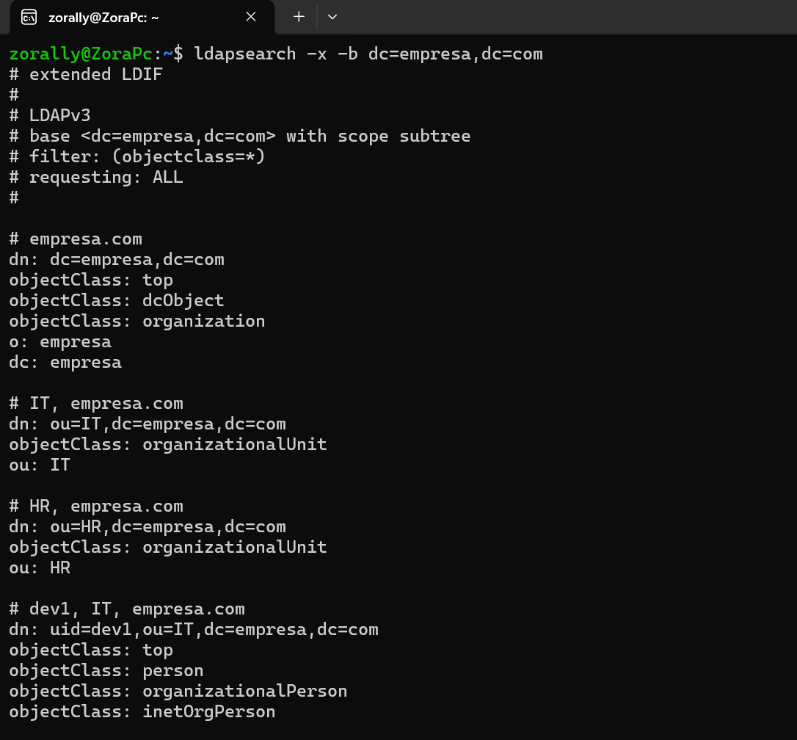
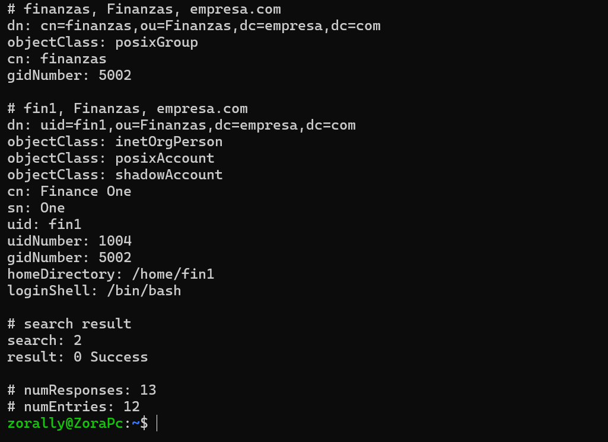
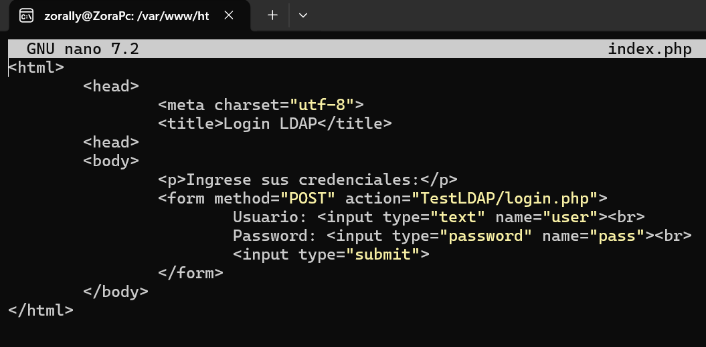
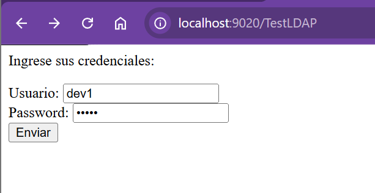
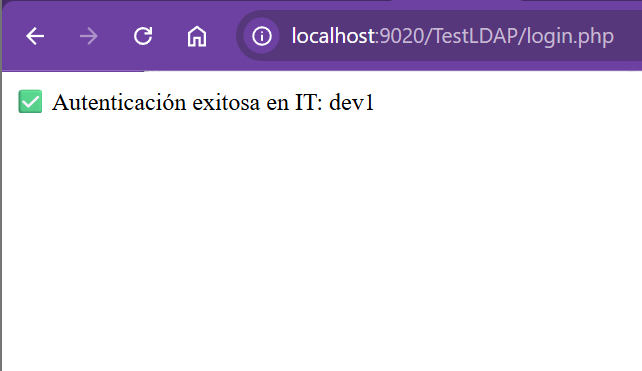
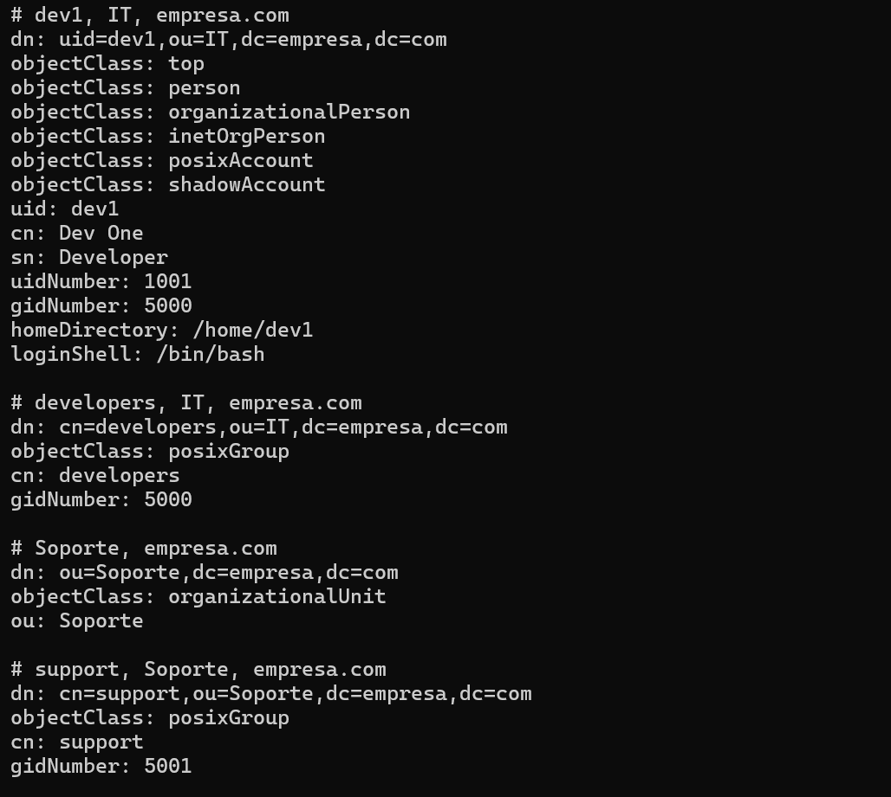
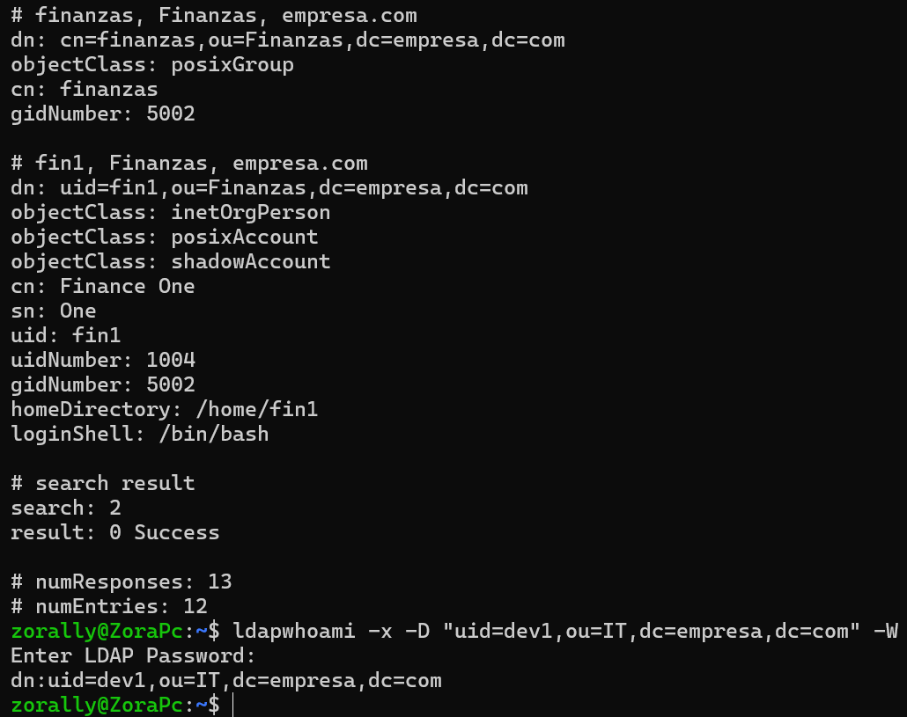
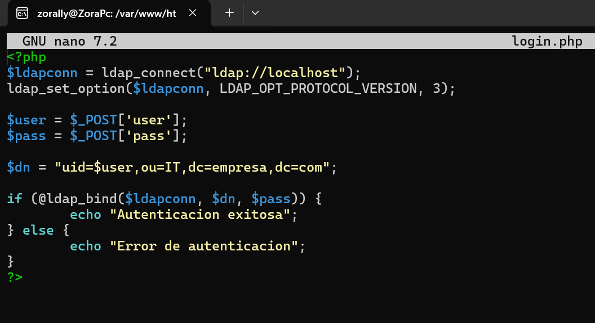
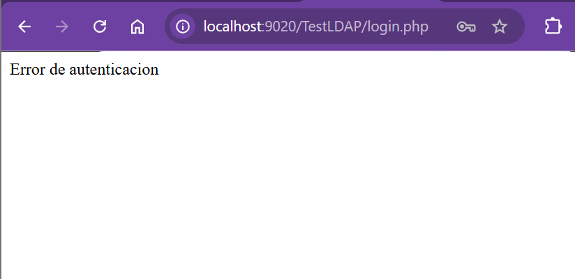
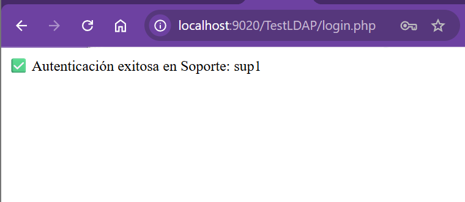
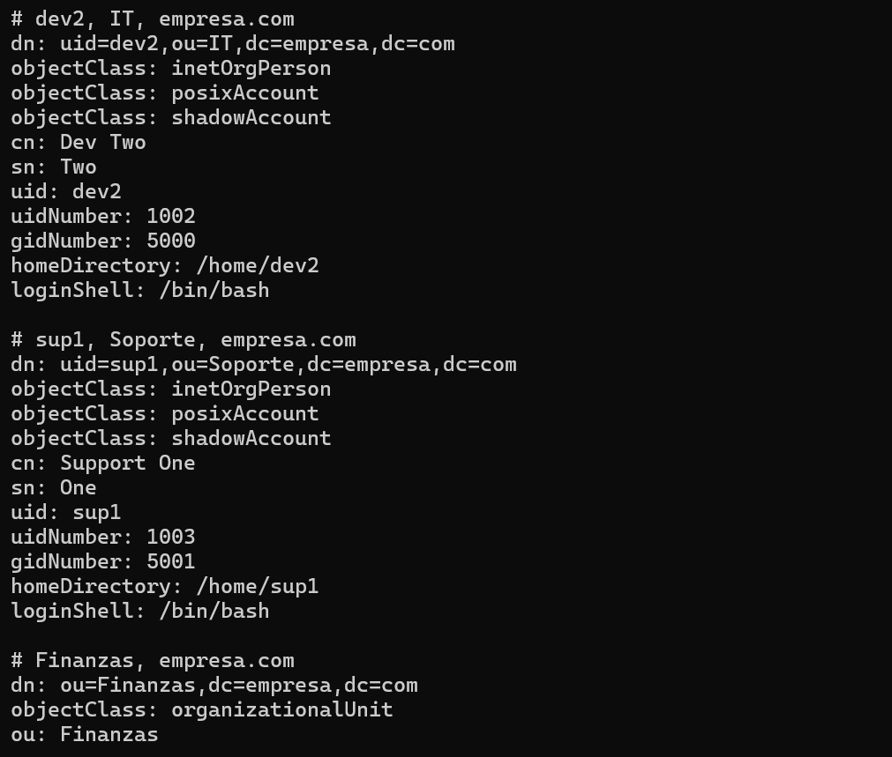
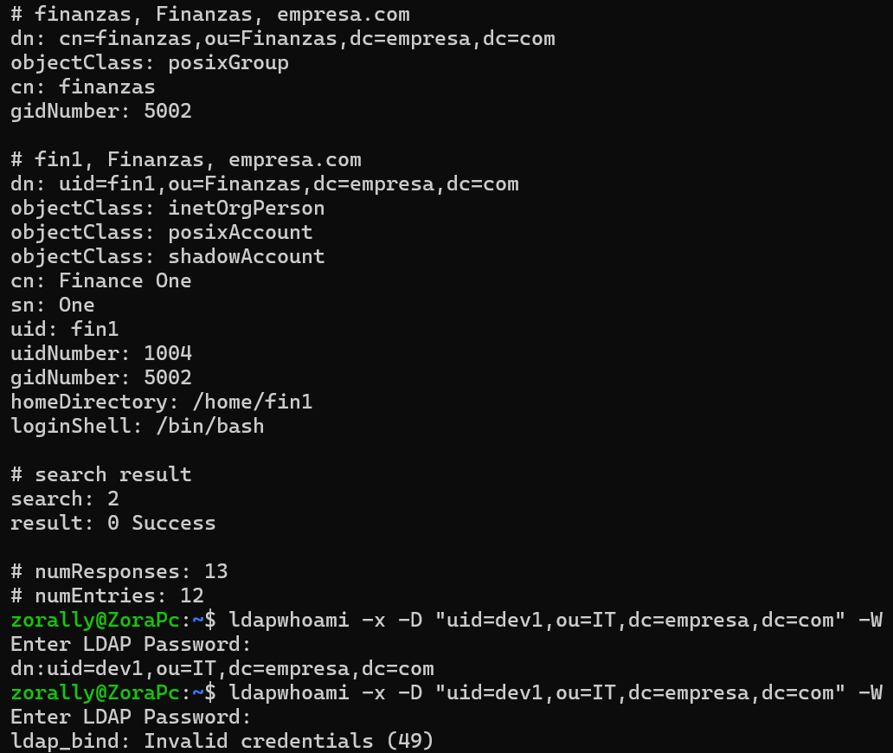
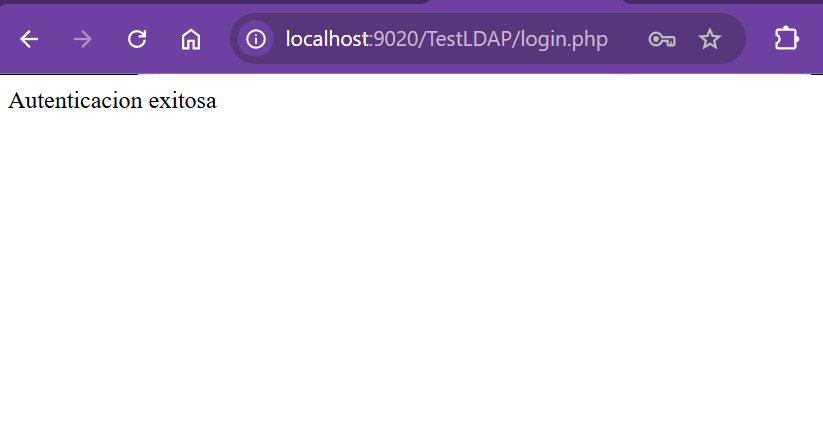
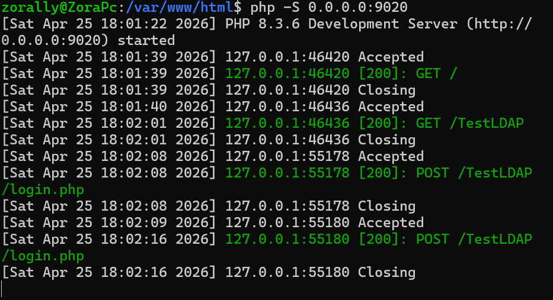
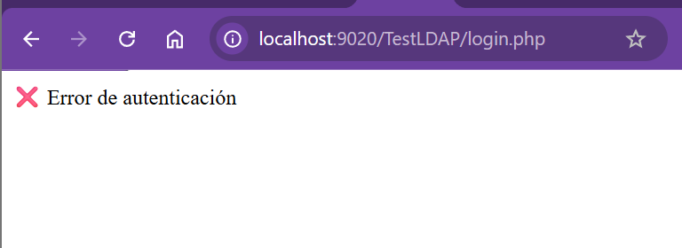

